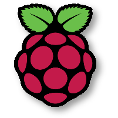

# Running Hugging Face Models on a Raspberry Pi with Modzy Edge


<div align="center">




**This repository includes detailed instructions and the corresponding code for deploying, serving, and running a Hugging Face model on a Raspberry Pi with Modzy Edge.**


</div>

## Overview

This repository includes detailed instructions and the corresponding code for deploying, serving, and running a Hugging Face model on a Raspberry Pi using Modzy's edge feature. We will start from a model card on Hugging Face's model hub and transform it into a microservice accessible with APIs on an edge device. The instructions included in this README are specific to a Raspberry Pi device, but you can follow along with your own preferred remote device (Linux OS with ARM or AMD chip).

Below is a quick overview of this README's contents:

* [Environment Setup](#environment-setup): Set up your Python environment and remote device
* [Hugging Face Model Containerization](#containerize-hugging-face-model): Convert a Hugging Face model into a portable, interoperable Docker container
* [Run Model on Pi with Modzy](#run-model-on-pi-with-modzy-edge): Leverage Modzy Edge feature to deploy, serve, and run model with just a few lines of code

## Environment Setup

This section provides instructions for setting up your environment and installing dependencies you will need (both locally and on remote device) to execute the code in this repository.

Start by cloning this project into your directory:

```bash
git clone https://github.com/modzy/modzy-edge-hugging-face-raspberry-pi.git
```

### Python Environment Setup

Next, we will need to set up a Python environment to run the [Jupyter Notebook](./Hugging%20Face%20%26%20Raspberry%20Pi%20with%20Modzy%20Edge.ipynb) code and our example [Flask App](./flask-app/README.md).

1. Install Python version >= 3.6
2. Create a virtual environment (venv, conda, or your virtual environment of choice)
3. Activate your virtual environment, and install Jupyter Notebooks using the appropriate [install instructions](https://jupyter.org/install)
4. At a minimum, install the following python libraries to be able to run the [Notebook](./Hugging%20Face%20%26%20Raspberry%20Pi%20Tech%20Talk.ipynb) referenced in the YouTube video recording.

```bash
pip install torch transformers[torch] numpy chassisml modzy-sdk grpcio~=1.50.0 protobuf~=4.21.9 google-api-core~=2.8.1
```

Now, simply open a Jupyter Notebook kernel and begin working with the code.

### Raspberry Pi Setup

In this section, we will take the steps to properly install an OS onto your Raspberry Pi and install Docker. These are the only two mandatory requirements to download and run our model. 

#### Install Raspbian on your Raspberry Pi
To image your Raspberry Pi from scratch, do the following:
1. Download and install the Raspberry Pi Imager [here](https://www.raspberrypi.com/software/)
2. Insert a microSD card into your comptuer then open up the Raspberry Pi Imager (16GB recommended)
3. Click on "Choose OS" and select `Raspberry Pi OS Lite (64-bit)` (a port of Debian with no desktop that supports Raspberry Pi models 3, 4, and 400)
4. Click on "Choose Storage" then select your microSD card
5. Click on the ⚙️ icon then select the following checkboxes and fill in all necessary info
    * ☑️ Enable SSH (and 🔘 Use password authentication)
    * ☑️ Set username and password
    * ☑️ Configure wireless LAN
5. Click "Save" then click "Write"
6. Eject the microSD card from your computer then slide it into your Pi's microSD card slot
7. Power on your Raspberry Pi, then wait a few minutes
8. SSH into your Pi

```bash
$ ssh pi@raspberrypi
pi@raspberrypi's password:
pi@raspberrypi:~ $
```

9. Finally, update your packages

```bash
$ sudo apt-get update
$ sudo apt-get upgrade
$ reboot
```

#### Install Docker
The easiest way to install Docker on a Raspberry Pi is to use a convenience shell script provided by the nice people at Docker. Full instructions can be found [here](https://docs.docker.com/engine/install/debian/)

```bash
$ curl -fsSL https://get.docker.com -o get-docker.sh
$ sudo sh get-docker.sh
```

To make sure Docker is up and running, you can type the following:

```bash
$ sudo docker ps
CONTAINER ID   IMAGE     COMMAND   CREATED   STATUS    PORTS     NAMES
```

*NOTE: While the following instructions are specific to setting up a Raspberry Pi, you may perform the equivalent steps on the edge or remote device of your choice.*

## Containerize Hugging Face Model :hugs:

*Note: If you would like follow along in this section of the notebook, you must first create a free account on [Dockerhub](https://hub.docker.com/signup). If, however, you wish to skip this portion, you can use this pre-built [Docker container](https://hub.docker.com/repository/docker/modzy/tinybert-arm).*

Once you have wrapped up setting up your local Python environment and remote device, you can begin experimenting with your Hugging Face Model, Chassis, and gRPC APIs. The [notebook](./Hugging%20Face%20%26%20Raspberry%20Pi%20Tech%20Talk.ipynb) includes instructions for executing the various workflows, but below are additional high-level instructions with more context.

We start by downloading this [TinyBERT model](https://huggingface.co/gokuls/BERT-tiny-emotion-intent?text=I+like+you.+I+love+you) from Hugging Face via the [Transformers](https://huggingface.co/docs/transformers/main/en/index) library. If instead you choose to use a different model, make sure to modify the included code as necessary.

Next, we will leverage [Chassis](https://chassis.ml) to automatically convert this Hugging Face model into a portable and interoperable Docker container. To learn more about Chassis, these resources and guides are a great place to start:
* ✔️[Chassis Overview](https://chassis.ml/conceptual-guides/overview/)
* 🚧[Build and Publish a Scikit-learn model](https://chassis.ml/tutorials/ds-connect/)
* 🔌[Install Chassis with a private docker registry](https://chassis.ml/how-to-guides/private-registry/)
* ❓[Frequently Asked Questions](https://chassis.ml/common-errors/)
* 📚[gRPC Overview](https://chassis.ml/conceptual-guides/grpc/)
* 📑[Full API and SDK Reference](https://chassis.ml/service-reference/)

After following this portion of the notebook, you will have built and published a Hugging Face model container to your Dockerhub account.

## Run Model on Pi with Modzy Edge

In this section, we will leverage [Modzy's](https://modzy.com) Edge capability to deploy and run this model on an edge device. In this [similar repository](https://github.com/modzy/hugging-face-raspberry-pi), we explore performing this same set of actions directly with Docker and gRPC. But in this scenario, Modzy's edge capability allows you to scale this model to as many devices as you need, serve and consume them through a standard API, and fully manage the model in production, regardless of where the model is running.

For the full tutorial and instructions, visit https://docs.modzy.com.